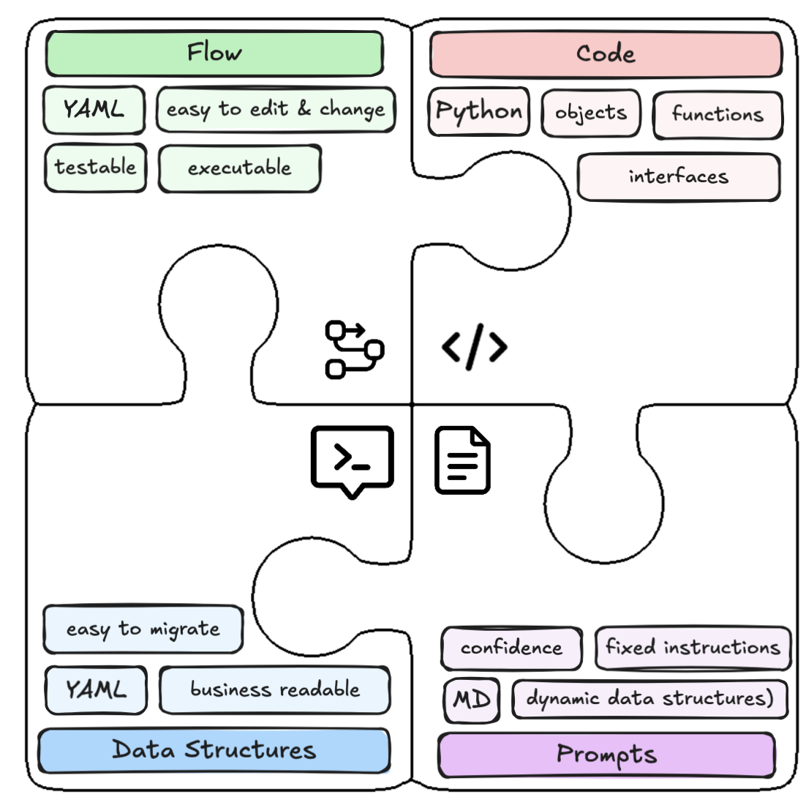

# Agy - Small Agent Flow Engine

Agy is a Python library for building, executing, validating and testing
agent-based workflows with a compact flow language called FLOWSY.

## Features

- **FLOWSY flow definition** Setup agent workflows really fast with a simple,
  indentation-based format (FLOWSY - Flows. Simple. YAMLish)
- **Clean separation of process flow, data, prompt and code** Flow and data
  structures can be edited and changed without the need to change the code
- **Agy Flows can be executed automatically** they can be changed, verified and
  tested put into production without deployment
- **Agy Data Structures can be maintained easily** They can be changed, updated,
  verified, migrated without changing the code of the application or database
  tables manually
- **Write instructions instead of maintaining full prompts** Use reusable
  instruction files and templates for LLM actions.
- **Built-in validation and execution** Validate flows before runtime and
  execute them with strict context checks.



## Quick Start

### Option 1: Initialize with `agy init` (recommended)

```bash
# Install agy globally with uv
uv tool install agy

# Create a new project from template
agy init --template email_routing_mock
# or: agy init
# or: agy init --template software_support_jira
# or: agy init --template email_routing_gmail
# or: agy init --template email_routing_graph
# or: agy init --template email_routing_imap_smtp

# Setup and run
cd agy_email_routing_mock
uv sync
uv run python main.py
```

### Option 2: Add to existing project

```bash
uv add agy
```

Or with pip:

```bash
pip install agy
```

### Installation Scope

The first public release keeps Email and Jira integrations in the core package,
so the templates work without extra dependency groups:

```bash
uv sync
```

### Environment Variables

For a complete list of required and optional environment variables (LLM
providers, Jira, Graph/Gmail/IMAP-SMTP email, and safety settings), see:

- [docs/agy/ENVIRONMENT_VARIABLES.md](docs/agy/ENVIRONMENT_VARIABLES.md)

For runnable repository examples, use:

```bash
cp .env.example .env
```

Then set values required by the examples you run (`JIRA_URL`, `JIRA_TOKEN`,
`JIRA_ISSUE_KEY`, `JIRA_JQL`, `OPENAI_API_KEY`).

More on the project structure: See
[docs/agy/CLI_PROJECT_STRUCTURE.md](docs/agy/CLI_PROJECT_STRUCTURE.md)

### Migrating From Private Git Installs

If an existing project installed Agy from a private Git URL, switch to the
public package:

```toml
[project]
dependencies = ["agy>=1.0"]
```

The Python import path is unchanged (`import agy`). See
[docs/AGY_VS_AGY_PRIVATE.md](docs/AGY_VS_AGY_PRIVATE.md) for a full migration
guide from `agy-private` 0.8.1.

### Define A Flow (Email)

Create a simple email routing flow that classifies emails and routes them to the
appropriate department.

**1. Define the flow** (`email_routing_flow.flowsy`):

```flowsy
name: Email Routing Flow
description: Classify and route customer emails
context_in:
  email: Email

nodes:
  classify_email:
    actions:
      - category = classify(input_text=email.text, categories=["sales", "support", "billing"], instruction_file="prompts/email_classify_instruction.md")
    edges:
      - confidence < 0.8: handle_unclear
      - category == "sales": handle_sales
      - category == "support": handle_support
      - category == "billing": handle_billing

  handle_sales:
    actions:
      - email.forward("sales@example.com")
      - email.move("processed")

  handle_support:
    actions:
      - answer = respond(input_text=email.text, instruction="Provide helpful support answer")
      - email.reply(answer)
      - email.move("processed")

  handle_billing:
    actions:
      - answer = respond(input_text=email.text, instruction="Handle billing inquiry professionally")
      - email.reply(answer)
      - email.move("processed")

  handle_unclear:
    actions:
      - email.move("human_team")
```

**2. Run the flow** (`main.py`):

```python
import asyncio
from agy import Flow
from objects.email import Email

async def main():

    # Create email object
    email = Email(
        sender="customer@example.com",
        recipient="support@company.com",
        subject="Urgent",
        text="I need help with my invoice #12345. I was charged twice.",
    )

    # Validate the flow once against the expected context classes (optional)
    validation_result = Flow.validate("email_routing_flow.flowsy", context_in={"email": Email})
    if not validation_result.is_valid:
        print(f"Validation failed: {len(validation_result.errors)} errors")

    flow = Flow.from_flowsy("email_routing_flow.flowsy")

    # Execute flow with concrete object instances
    result = await flow.run(context_in={"email": email})

    print(f"Category: {result.get('result')}")
    print(f"Confidence: {result.get('confidence')}")

asyncio.run(main())
```

*Try it yourself:*

```bash
# if you have not done it:
uv run agy init --template email_routing_mock
cd agy_email_routing_mock

# make sure, that you have your personal model key of the model you want to use in your ENV
# Default model in the pyproject.toml is a (small) OPENAI model, please change, if your favorite model is a different one
export OPENAI_API_KEY="sk-........................"

python main.py
```

### Second simple example

See `docs/integrations/EMAIL.md` and `docs/agy/FLOW.md` for complete end-to-end
examples.

### Example for data structures

Use `context_in` to inject domain objects (for example `Email`, `JiraClient`)
and call their methods directly in flow actions.

### Agy flow structure

> **📖 Complete Parsing Reference**: For detailed information about the
> `.flowsy` file format, indentation rules, expression syntax, and parsing
> details, see [docs/agy/FLOW_PARSING.MD](docs/agy/FLOW_PARSING.MD).

A flow consists of:

- **Metadata** (`name`, `description`)
- **Inputs** (`context_in`)
- **Nodes** (ordered processing steps with `actions`)
- **Edges** (conditional routing to next nodes or `end(...)`)

#### Flow Metadata

```flowsy
name: My Flow
description: Brief description of what this flow does
context_in:
  variable_name_1: TypeName2
  variable_name_2: TypeName2
```

- **`context_in`**: Input parameters passed to the flow
  - Can be simple types (str, int) or custom objects (Email, Document, etc.)
  - Accessible in all nodes via variable names, their attributes and methods:
    "email.reply (...)"

#### Nodes

Nodes are the building blocks of your flow. Each node has:

```flowsy
nodes:
  node_name:
    actions:
      - action1()
      - result = action2(param=value)
    edges:
      - condition: target_node
      - True: fallback_node
```

- **Node name**: Identifier for this step in the flow
- **Actions**: List of operations executed sequentially
- **Edges**: Conditional routing to next nodes

#### Stochastic Nodes

Stochastic nodes delegate one or more natural-language requests to an agent
object from `context_in`. The agent must expose a callable `run(...)`
method. Agy normalizes the agent result and writes the final output, message,
all intermediate outputs, `success`, `error_msg` and `result` into the flow
context before evaluating edges.

```flowsy
context_in:
  consc: Consciousness
  project_name: str

nodes:
  summarize_yesterday:
    type: stochastic
    agent: consc
    requests:
      - f'Find all mails discussing {project_name} in all different spellings in the mails of the last two weeks.'
      - "Create a Markdown table with content, sender and urgency."
      - "Add an answered column showing whether I answered the topic in substance."
    output: email_report_md
    message: agent_message
    edges:
      - success == True: send_report
      - True: end(success=False, error_msg=error_msg)

  send_report:
    actions:
      - df = format_md_to_pd(email_report_md)
      - filename = save_df_to_excel(df)
```

Agent return values are normalized to an `AgentRequestResult` shape with
`outputs`, `output`, `message`, `success`, `error_msg` and `raw`. Returning a
plain string is also supported and is treated as a successful output.

Each `requests:` entry may be plain text or a Python expression evaluated with
the current flow context before calling `agent.run(...)`. Evaluated request
expressions must return a string.

#### Actions

Actions are operations executed within a node:

```flowsy
actions:
  # Simple action call
  - show("Hello, here I am")

  # Action with result assignment
  - result = classify(input_text=text, categories=["legal", "business", "scientific"])

  # Object method calls
  - database.save(record)
  - api.send_request(data)
```

*Built-in actions, LLM:**`classify()`, `respond()`, `extract()`**IO:*

`load_files_text()`, `show()` **FLow Control:** `end()` Details: see below

#### Edges

Edges define the flow routing from one node to another:

```flowsy
edges:
  # Conditional edge (evaluated in order)
  - confidence < 0.8: low_confidence_handler
  - category == "urgent": urgent_handler

  # Unconditional edge (fallback)
  - True: default_handler

  # Implicit termination of the flow
  # finalizing the last action of a node WITHOUT edges => successful termination of the flow

```

### Flow Actions, Built-in & Custom

Actions are the executable operations within flow nodes. They are processed
sequentially by the `ActionExecutor` and can modify the flow's context.

#### Action Execution Flow

1. **Sequential Execution**: Actions in a node are executed **one by one** in
   the order they appear
2. **Context Updates**: Each action can read from and write to the shared
   context dictionary
3. **Error Handling**: If an action fails (`success=False` in context):
   - Remaining actions in the node are **skipped**
   - Execution **jumps to edge evaluation**
   - Edges can route to error handling nodes
4. **Termination**: The `end()` action immediately terminates the flow with
   custom context values

*Example:*

```flowsy
nodes:
  example_node:
    actions:
      - result1 = action1()  # Executes first
      - result2 = action2()  # Executes only if action1 succeeded
      - action3()            # Executes only if action1 & action2 succeeded
```

#### Action Types

*Two types of actions:*

1. **Global Functions** (`global_function` actions)
   - Registered in `ActionRegistry`
   - Called by name: `classify()`, `respond()`, `show()`
   - Built-in contrib actions are auto-loaded
   - Custom actions registered via `flow.run(action_types=[...])`

2. **Object Methods**
   - Called on objects from `context_in`
   - Syntax: `object_name.method_name(args)`
   - Example: `email.reply("Thanks")`, `document.save()`

#### Built-in Actions (Contrib)

##### High-Level LLM Actions

All LLM actions return a dictionary with their result and a `confidence` value
(0.0-1.0) that is automatically written to the context for flow routing
decisions.

**`classify()`** - Classifies text based on generic classification prompt,
custom categories and optional instructions/augmentation

```yaml
nodes:
  - classify_document:
      actions:
        - category = classify(input_text=document.text, categories=["legal",
          "business", "financial"], instruction_file="cat_guide_acme.md")
        # Returns: category="legal", confidence=0.85 (both in context)
      edges:
        - confidence < 0.7: manual_review
        - category == "legal": process_legal_doc
        - category == "business": process_business_doc
        - category == "financial": process_financial_doc
```

**`respond()`** - Generates text using generic respond prompt, optional
instructions and augmentation context

```flowsy
- answer = respond(input_text=query, instruction_file="prompts/response.md", augmentation=search_results)
# Returns: answer="Generated text...", confidence=0.92 (both in context)
```

**`extract()`** - Extracts structured data using generic extract prompt and
schema definition

```flowsy
- invoice = extract(input_text=invoice_pdf_text, values_to_extract={"invoice_number": "str", "total": "float", "date": "str"})
# Returns: invoice={"invoice_number": "INV-123", "total": 1500.50, "date": "2025-01-15"}, confidence=0.88
```

**Note**: All LLM actions return their result and write `confidence` (0.0-1.0)
to context for easy access in edges.

##### Low-Level LLM Actions

- **`set_model_call(provider, model, **kwargs)`\*\* - Configure LLM
  provider/model for all subsequent LLM actions (OpenAI, Azure OpenAI, Gemini,
  Anthropic, or custom)
- **`model_call(prompt, **kwargs)`\*\* - Direct LLM call with custom prompt
  (uses configured provider/model)
- **`get_prompt_from_str(template,
  **kwargs)`** / **`get_prompt_from_file(file_path, **kwargs)`** - Format
  prompts with variables

*Multi-Provider Support:*

- Default provider/model configured in `pyproject.toml` `[tool.agy.llm]`
- Override per-flow with
  `set_model_call(provider="anthropic", model="claude-haiku-4-5-20251001")`
- Supported providers: OpenAI, Azure OpenAI, Google Gemini, Anthropic Claude,
  Fake (for testing)

##### Sub-Flow Calls and Batch Processing

**`run_flow()`** - Call another flow (or re-enter the current flow at a
specific node) and return its result:

```flowsy
# Call an external sub-flow
- sub = run_flow(flow="detail_check.flowsy", ticket=ticket, jira=jira)

# Jump to a node in the current flow
- sub = run_flow(node="classify", email=email)
```

**`run_flow_batch()`** - Run a sub-flow once per list element (sequential or
parallel):

```flowsy
- results = run_flow_batch(emails, element="email", flow="process.flowsy", mode="parallel")
```

Each iteration gets its own isolated context. Results are returned as a list.
Supports `on_error="continue"` (default) or `on_error="fail_fast"`.

**`search_emails()`** - Search an email account and return a `RecordSet` with
readable batch methods. Existing single-email flows still receive regular
`Email` objects; `RecordSet` is only used when a flow explicitly searches a
batch.

```flowsy
context_in:
  account: EmailAccount
  consc: Consciousness

nodes:
  retrieve_emails:
    actions:
      - retrieved_emails = search_emails(account, query="customs transfer", folders=["inbox"], batch_size=10)
      - current_email_batch = retrieved_emails.get_next_batch()
    edges:
      - screen_batch

  screen_batch:
    type: stochastic
    agent: consc
    requests:
      - "Review the current email batch and return the ids of emails that mention customs transfers."
    output: candidate_email_ids
    message: screening_message
    edges:
      - len(candidate_email_ids) > 0: load_candidate_emails
      - retrieved_emails.has_next_batch(): next_email_batch
      - finalize_not_found

  next_email_batch:
    actions:
      - current_email_batch = retrieved_emails.get_next_batch()
    edges:
      - screen_batch

  load_candidate_emails:
    actions:
      - candidate_emails = retrieved_emails.load_full(candidate_email_ids)
    edges:
      - deep_review
```

Use domain-specific variable names in flows, such as `retrieved_emails`,
`current_email_batch` and `candidate_emails`. Technically these are `RecordSet`
or `Record` values, but the flow should read like business logic.

**`search_files()`** - Search local files and return a `RecordSet` with the
same readable batch methods. File records start as metadata-only records;
`load_full(ids)` loads text only for selected candidates via Agy's file parsers.

```flowsy
context_in:
  root_path: str
  consc: Consciousness

nodes:
  retrieve_files:
    actions:
      - retrieved_files = search_files(root_path=root_path, query="customs", file_extensions=["pdf", "docx", "md"], batch_size=10)
      - current_file_batch = retrieved_files.get_next_batch()
    edges:
      - screen_file_batch

  screen_file_batch:
    type: stochastic
    agent: consc
    requests:
      - "Review the current file batch and return the ids of files that mention customs transfers."
    output: candidate_file_ids
    message: file_screening_message
    edges:
      - len(candidate_file_ids) > 0: load_candidate_files
      - retrieved_files.has_next_batch(): next_file_batch
      - finalize_not_found

  load_candidate_files:
    actions:
      - candidate_files = retrieved_files.load_full(candidate_file_ids)
    edges:
      - deep_review
```

##### Other Notable Built-in Actions

- **`load_files_text()`** - Load and parse files (PDF, DOCX, XLSX, TXT, HTML)
- **`show()`** - Print debug information
- **`end()`** - Explicitly terminate flow with custom context values

**Full reference:** See
[docs/agy/ACTIONS_REFERENCE.md](docs/agy/ACTIONS_REFERENCE.md)

#### Custom Actions

Define custom actions using `ActionType` and pass them to `flow.run(...)`:

```python
from agy import ActionType, Flow

def calculate_score(value: int, multiplier: int = 2) -> int:
    """Calculate a score by multiplying value with multiplier."""
    return value * multiplier

score_action = ActionType(
    object_name="global_function",
    method_name="calculate_score",
    kwargs={"value": int, "multiplier": int},
    callable=calculate_score
)
flow = Flow.from_flowsy("my_flow.flowsy")
result = await flow.run(action_types=[score_action], context_in={})
```

**Full guide:** See
[docs/agy/ACTIONS_REFERENCE.md](docs/agy/ACTIONS_REFERENCE.md)

### Flow Data and context_in

#### Passing Data to Flows

Flows receive input data through `context_in` when executed:

```python
from agy import Flow
from objects.email import Email

# Create flow
flow = Flow.from_flowsy("email_routing_flow.flowsy")

# Create context objects
email = Email(text="...", From="user@example.com")

# Execute with context_in
result = await flow.run(context_in={"email": email})
```

*Flow file declares required inputs:*

```flowsy
context_in:
  email: Email
  settings: dict
```

`flow.run(...)` validates that all declared keys are provided at runtime.

#### The Context Dictionary

The flow maintains a **context dictionary** that:

- Stores all `context_in` objects
- Accumulates variables assigned in actions
- Holds standard result keys

**Standard context keys** (automatically managed):

- `success` (bool): Indicates if the last action succeeded
- `error_msg` (str): Error message if action failed
- `confidence` (float): Confidence value from LLM actions
- `category` (str): Category from classify()
- `result` (any): Default output variable for actions: Every function call,
  method call wit return value not None and without defined output variable
  writes to result:

```yaml
actions:
  - add (0.2, 0.52)
  # result = 0.72
```

*Variable scope:*

- Variables from `context_in` are available everywhere
- Variables assigned in actions (e.g., `answer = respond(...)`) are available
  in:
  - Subsequent actions in the same node
  - Edge conditions in the same node
  - All nodes reached later in the flow execution

*Accessing context data in actions:*

```flowsy
actions:
  # Access context_in object
  - show(email.Subject)

  # Access object attributes
  - classify(input_text=email.text, ...)

  # Access assigned variables
  - respond(input_text=question, augmentation=search_results)

  # Access dict keys
  - value = settings["api_key"]
```

#### Return Values

After execution, `flow.run()` returns the final context dictionary:

```python
context = await flow.run(context_in={"email": email})

# Access results
print(context["success"])      # True/False
print(context["category"])     # From classify()
print(context["confidence"])   # From LLM actions
print(context["error_msg"])    # Error message if any
print(context["custom_value"]) # Any value set via end(custom_value=...) or as an action "- custom_value = action_x ()"
```

### Edges

Edges define conditional routing between nodes. They are evaluated
**sequentially** until a match is found.

#### Edge Types

*Conditional Edge:*

```flowsy
edges:
  - confidence < 0.7: manual_review
  - category == "urgent": urgent_handler
```

*Unconditional Edge (Fallback):*

```flowsy
edges:
  - True: default_handler  # Always matches if reached
```

As a friendlier shorthand, the final edge may omit the condition entirely:

```flowsy
edges:
  - confidence < 0.7: manual_review
  - default_handler  # Same as `True: default_handler`; only valid as the last edge
```

*No Edges (Implicit Termination):*

```flowsy
nodes:
  final_step:
    actions:
      - email.reply("Done!")
    # No edges = flow ends here
```

#### Edge Evaluation

1. **Top to Bottom**: Edges are evaluated in order
2. **First Match Wins**: First edge with true condition is taken
3. **Condition Syntax**: Standard Python expressions using context variables
   - Comparisons: `<`, `>`, `<=`, `>=`, `==`, `!=`
   - Boolean: `and`, `or`, `not`
   - Membership: `in`, `not in`
4. **No Match**: If no edge matches and no fallback exists → **error**

*Examples:*

```flowsy
edges:
  # Numeric comparison
  - confidence < 0.7: low_confidence

  # String equality
  - category == "urgent": urgent_handler
  - status == "approved": process_approval

  # Boolean checks
  - is_valid and not requires_review: auto_approve

  # Multiple conditions
  - confidence >= 0.8 and category == "sales": high_confidence_sales

  # Fallback (always true)
  - True: default_handler
```

#### Termination

*Implicit Termination:*

- Node with no edges terminates the flow
- `success` is `True` if all actions succeeded, `False` if any failed

*Explicit Termination:*

```flowsy
- end(success=False, error_msg="Validation failed")
```

*Edge to `end`:*

```flowsy
edges:
  - is_complete: end(success=True)  # Terminates flow
  - continue_processing
```

## Releasing

To create a new release (bump version, tag, and publish GitHub Release with build artifacts), follow the steps in [docs/dev/RELEASE_STEPS.md](docs/dev/RELEASE_STEPS.md).
