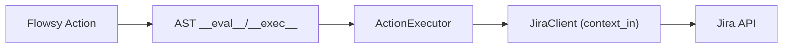

# Jira Integration

This guide shows how to use Jira in AGY with the object-first pattern
(`JiraClient` in `context_in`).

## Overview

The Jira integration provides:

- `JiraClient` for API operations
- Business objects: `JiraIssue`, `JiraTransition`, `JiraComment`
- Flow-friendly method calls from FLOWSY actions

Supported operations:

- `get_issue`, `search_issues`, `create_issue`, `update_issue`, `delete_issue`
- `transitions`, `transition`, `assign`, `add_comment`, `get_comments`

## Install

```bash
uv add agy
```

If you also need email integrations in the same project:

```bash
uv add agy
```

## Environment Variables

Required:

- `JIRA_URL` (for example `https://my-company.atlassian.net`)
- `JIRA_TOKEN` (API token)
- `JIRA_ISSUE_KEY` (ticket key for single-ticket workflows)
- `JIRA_JQL` (optional, for query-based workflows)

## Quick Start

```python
import asyncio

from agy import Flow
from agy.integrations.jira import JiraClient


async def main():
    import os

    flow = Flow.from_flowsy("mini_jira.flowsy")
    jira = JiraClient.from_env()
    context = await flow.run(
        context_in={"jira": jira, "issue_key": os.environ["JIRA_ISSUE_KEY"]}
    )
    print(context["result"])


asyncio.run(main())
```

## FLOWSY Usage

Use Jira as a context object:

```flowsy
context_in:
  jira: JiraClient
  issue_key: str

nodes:
  fetch_issue:
    actions:
      - issue = jira.get_issue(issue_key)
      - result = issue.to_dict()
    edges:
      - True: end(success=True, result=result)
```

### Mini Example (copy/paste)

Small end-to-end example that fetches one issue and prints key/summary/status.

`mini_jira.flowsy`:

```flowsy
name: Mini Jira Fetch
description: Fetch a Jira issue and return a short summary
context_in:
  jira: JiraClient
  issue_key: str

nodes:
  fetch:
    actions:
      - issue = jira.get_issue(issue_key)
      - result = {"key": issue.key, "summary": issue.summary, "status": issue.status}
    edges:
      - True: end(success=True, result=result)
```

`run_mini_jira.py`:

```python
import asyncio
import os

from agy import Flow
from agy.integrations.jira import JiraClient


async def main():
    jira = JiraClient.from_env()
    flow = Flow.from_flowsy("mini_jira.flowsy")
    context = await flow.run(
        context_in={"jira": jira, "issue_key": os.environ["JIRA_ISSUE_KEY"]}
    )
    print(context["result"])


asyncio.run(main())
```

## Full Template

For a full software-support routing workflow (classify ticket, close invalid,
answer FAQ tickets, assign specialist tickets), use:

```bash
uv run agy init --template software_support_jira
cd agy_software_support_jira
python main.py
```

## JiraIssue Model and Custom Fields

`JiraIssue` includes core Jira fields and keeps additional custom fields in
`extra_fields`.

Core attributes:

- `key`, `summary`, `status`, `issuetype`
- `assignee`, `reporter`, `description`
- `labels` (`list[str]`)
- `extra_fields` (`dict[str, Any]`)

### Build from `{key, fields}` payloads

`JiraIssue.from_dict(...)` accepts Jira-style payloads from API responses,
webhook `issue` objects, or exports:

```python
from agy.integrations.jira import JiraIssue

issue = JiraIssue.from_dict(raw_issue_dict)
print(issue.labels)
print(issue.extra_fields)
```

Behavior:

- Known Jira base fields are mapped to model attributes.
- Unknown non-`None` fields are stored in `extra_fields`.
- `None` custom fields are skipped to avoid bloating `extra_fields`.

### Optional field mapping

You can rename raw Jira field IDs to canonical names:

```python
mapping = {
    "customfield_17107": "tsp_name",
    "customfield_17103": "tracking_link",
}

issue = JiraIssue.from_dict(raw_issue_dict, field_mapping=mapping)
print(issue.extra_fields["tsp_name"])
```

### Subclass routing for mapped fields

If a mapped canonical name matches an attribute on a `JiraIssue` subclass, it is
written to that attribute; otherwise it stays in `extra_fields`.

```python
from dataclasses import dataclass
from agy.integrations.jira import JiraIssue

@dataclass(slots=True)
class FiegeIssue(JiraIssue):
    tsp_name: str = ""

issue = FiegeIssue.from_dict(
    raw_issue_dict,
    field_mapping={"customfield_17107": "tsp_name"},
)
print(issue.tsp_name)
```

Notes:

- AGY stores custom field values as-is (no parsing/normalization of Jira link formats).
- Core attributes are protected from accidental overwrite by custom mappings.

## Issue-level Comment API

Issues returned from `JiraClient` are bound to that client and can work with
comments directly:

```python
issue = jira.get_issue("PROJ-1")
issue.add_comment("Automatic triage completed.")
comments = issue.get_comments()
```

Behavior:

- `issue.add_comment(text)` delegates to Jira and returns a `JiraComment`.
- `issue.get_comments()` returns `list[JiraComment]` sorted
  reverse-chronologically (newest first).

`JiraComment` fields:

- `id` (str)
- `body` (str)
- `created` (str, Jira timestamp)
- `author` (str | None)

If you construct `JiraIssue(...)` manually (not via `JiraClient`), comment
methods raise a `ValueError` because no Jira client is bound.

## Issue-level Description and Sub-task API

Issues returned from `JiraClient` can also update description text and create
child issues directly:

```python
issue = jira.get_issue("PROJ-1")

# Append text to description (default: bottom)
issue.append_to_description("Follow-up details from support call.")

# Or prepend at top
issue.append_to_description("Urgent update", position="TOP")

# Create Jira Sub-task under this issue
subtask = issue.add_subtask(
    headline="Collect missing logs",
    description="Ask customer for app logs and attach to parent issue.",
)
```

Behavior:

- `issue.append_to_description(text, position="BOTTOM")` supports `TOP` or
  `BOTTOM` and updates Jira `description`.
- `issue.add_subtask(headline, description="", issue_type="Sub-task")` creates
  a Jira issue with `parent={"key": <issue_key>}` linkage.
- `issue_type` accepts Jira naming (`Sub-task`) and also normalizes alias input
  like `"subtask"` to `Sub-task`.
- Like comment operations, both methods require a client-bound `JiraIssue`.


## Execution Flow



## Notes

- **`transition(issue_key, transition, *, fields=None, update=None)`** accepts
  either a transition **ID** (int or numeric string) or a **name** (e.g.
  `"Done"`, `"Closed"`). If a name is passed, the client resolves it to an ID
  via the Jira API. Optional `fields` and `update` dicts are sent alongside the
  transition for **transition screens** (e.g. required fields when moving an
  issue to "Done"):

  ```python
  jira.transition("PROJ-42", "Done", fields={"resolution": {"name": "Fixed"}})

  jira.transition("PROJ-42", "In Review", update={
      "comment": [{"add": {"body": "Moving to review."}}]
  })
  ```

  When neither `fields` nor `update` is provided, a simple status change is
  performed.
- `JiraClient.from_env()` validates required env vars.
- For tests, pass a mocked underlying Jira client directly to
  `JiraClient(..., client=mock_client)`.
- Jira methods return business objects; call `.to_dict()` where plain dict
  output is preferred.
